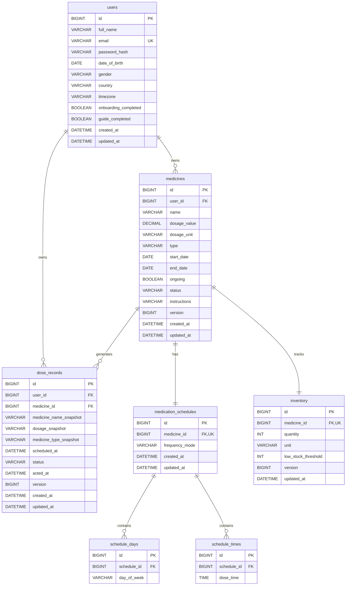

# DoseMate Database Schema Specification

## 1. Overview
The DoseMate database is hosted on **MySQL 8.0+** using the `utf8mb4` character set and `utf8mb4_0900_ai_ci` collation. It enforces relational integrity, user ownership boundaries, non-negative inventory policies, and history preservation.

## 2. Entity Relationship Diagram (ERD)

## 3. Table Details & Integrity Rules

### 3.1 `users`
- **Email Uniqueness:** `email` is strictly unique (`uq_users_email`).
- **Gender Values:** constrained to `MALE`, `FEMALE`, `OTHER`, `PREFER_NOT_TO_SAY`.
- **Timezone:** stored (e.g. `'America/New_York'`, `'Asia/Karachi'`) to correctly align notification triggers and day rollovers.

### 3.2 `medicines`
- **Ownership Isolation:** Every medicine belongs to a `user_id`. All queries filter by `user_id` to guarantee tenant isolation.
- **Dosage Validation:** `dosage_value > 0` enforced by CHECK constraint.
- **Medicine Types:** `TABLET`, `CAPSULE`, `SYRUP`, `INJECTION`, `DROPS`, `CREAM`, `SUPPLEMENT`.
- **Status Lifecycle:** `ACTIVE`, `PAUSED`, `DELETED`.
- **Soft Deletion & History Preservation:** When a user deletes a medicine, `status` becomes `DELETED`. The foreign key on `dose_records` sets `medicine_id = NULL` (`ON DELETE SET NULL`) while historical records remain intact.

### 3.3 `medication_schedules`, `schedule_days`, `schedule_times`
- **Normalized Child Tables:** As recommended in the architectural handoff, days and times are modeled as first-class relational child rows to enable fast and indexable querying.
- **Unique Day/Time Slots:** A schedule cannot contain duplicate days or duplicate times (`uq_schedule_day`, `uq_schedule_time`).

### 3.4 `inventory`
- **Non-Negative Guarantee:** `quantity >= 0` check constraint and explicit database transaction rules prevent underflow.
- **Threshold Alerting:** When `quantity <= low_stock_threshold`, the API triggers a `Needs Attention` item on the Dashboard.
- **Optimistic Locking:** `version` column prevents lost updates during concurrent refill or consumption requests.

### 3.5 `dose_records`
- **Status States:** `PENDING`, `TAKEN`, `SKIPPED`, `MISSED`.
- **Snapshot Immutability:** Includes `medicine_name_snapshot`, `dosage_snapshot`, and `medicine_type_snapshot`. Even if a medicine is modified or deleted, past records in the Medication History tab display the exact name and dosage at the time the dose was taken.
- **Slot Deduplication:** `UNIQUE KEY (medicine_id, scheduled_at)` ensures the schedule generator never generates duplicate dose instances for the same medicine and time slot.
- **Atomic Dose + Inventory Transaction:**
  Marking a dose as `TAKEN` executes within a `@Transactional` block:
  1. `dose_records` row is fetched with pessimistic lock (`SELECT ... FOR UPDATE`) or optimistic version check.
  2. Verifies current status is `PENDING` (or permitted transition).
  3. Updates dose status to `TAKEN` and sets `acted_at = NOW()`.
  4. Decrements `inventory.quantity` by the consumption amount (1 unit).
  5. If quantity would fall below 0, transaction aborts with `INSUFFICIENT_INVENTORY`.
  6. Commits atomically.

## 4. Migration Strategy
Migrations are managed automatically via **Flyway** in the Spring Boot backend (`src/main/resources/db/migration/V1__initial_schema.sql`).
